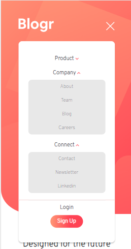
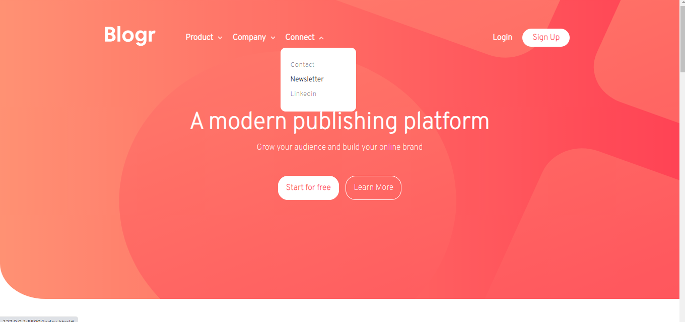

# Frontend Mentor - Blogr landing page solution

This is a solution to the [Blogr landing page challenge on Frontend Mentor](https://www.frontendmentor.io/challenges/blogr-landing-page-EX2RLAApP). Frontend Mentor challenges help you improve your coding skills by building realistic projects.

## Table of contents

- [Overview](#overview)
  - [The challenge](#the-challenge)
  - [Screenshot](#screenshot)
- [My process](#my-process)
  - [Built with](#built-with)
  - [What I learned](#what-i-learned)
  - [Useful resources](#useful-resources)
- [Author](#author)


## Overview

### The challenge

Users should be able to:

- View the optimal layout for the site depending on their device's screen size
- See hover states for all interactive elements on the page

### Screenshot





Above pictures are the screenshots of my solution.


## My process

### Built with

- HTML5
- CSS
- Flexbox
- CSS Grid
- Mobile-first workflow
- Vanilla JS


### What I learned

I learned some new css stuff like transform:transalate and its difference with position:absolute and i will defenitely use it for my future projects

```css
.proud-of-this-css {
    transform: translate(120px, -90px);
    transform: rotate(180deg);

}
```

### Useful resources

- [W3schools](https://www.w3schools.com/css/) - This helped me for remembering css syntax and its features.
- [W3schools] https://www.w3schools.com/howto/howto_css_dropdown.asp - this helped me learn css dopdown on hover.
- [W3schools](https://www.w3schools.com/js/) - This helped me for remembering js syntax and its features.


## Author

- Frontend Mentor - [@kristan-gitaccount](https://www.frontendmentor.io/profile/kristan014)


